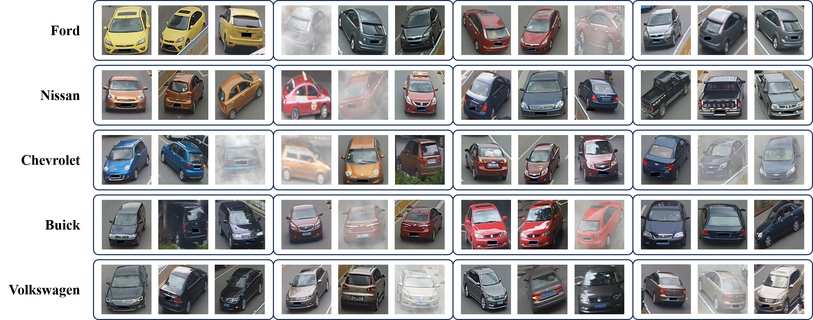
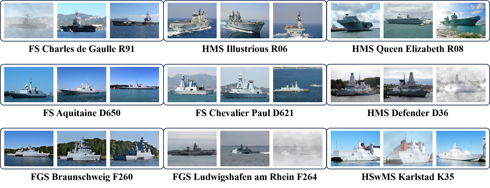

# MultiSight: A Vision-Language Model for Collaborative Understanding of Multi-View Remote Sensing Images

**MultiSight** is a vision-language model (VLM) designed to collaboratively understand and reason across multi-view remote sensing (RS) images. Unlike traditional single-image VLMs or general-purpose multi-image models, MultiSight explicitly models the relationships and complementary information across multiple views to support fine-grained and spatially grounded interpretation.

  

To enable this capability, MultiSight introduces two key modules:

- 🔄 **AMITEF (Adaptive Multi-Image and Text Encoding Fusion)**: Selectively fuses key features across multiple images and text prompts, allowing the model to distinguish and integrate salient information from different views.
- 🧠 **MVA (Multi-View Attention)**: Facilitates collaborative feature aggregation across images by capturing cross-view dependencies and reinforcing spatial consistency.

## 🧪 Tasks and Evaluation

MultiSight is evaluated on three multi-view remote sensing tasks that require fine-grained understanding and spatial localization:

1. **Fine-grained Vehicle Recognition**
2. **Fine-grained Ship Recognition**
3. **Building Localization**

MultiSight consistently outperforms baseline models in all tasks, especially under degraded imaging conditions (e.g., fog or low resolution). It demonstrates superior robustness, reasoning accuracy, and multi-view integration. However, limitations remain in:
- Recognizing rarely seen ship models due to limited pretraining;
- Efficient recall in localization tasks under high distractor interference.

To support benchmarking, we provide three aligned datasets:

---

## 📦 MultiSight Datasets

### 1. MultiSight-Vehicle

- **Base**: Extended from the VeRi dataset
- **Goal**: Classify vehicle models (e.g., Toyota, Ford) using 4–6 images from multiple viewpoints
- **Augmentation**: Random fog effects applied to simulate real-world degradation
- **Stats**:
  - 553 vehicle instances across 46 models
  - 21,438 multi-view groups (12,120 original, 9,318 augmented)
  - 105,912 images

  

### 2. MultiSight-Ship

- **Base**: Curated from [ShipSpotting.com](https://www.shipspotting.com)
- **Goal**: Recognize military ship models (e.g., CVN-79 aircraft carrier)
- **Augmentation**: Fog and cloud effects for realism and difficulty
- **Stats**:
  - 764 ship instances across 101 models
  - 5,099 multi-view groups (2,199 original, 1,426 cloud, 1,474 fog)
  - 12,699 images

  

### 3. MultiSight-Building

- **Base**: Derived from the University-1652 dataset
- **Goal**: Match a group of 3–5 UAV images of a building to the correct satellite image from a 10-candidate gallery
- **Distractor Selection**: Gallery distractors selected based on grayscale histogram similarity
- **Stats**:
  - 951 buildings
  - 15,025 query groups
  - 62,108 images (52,598 UAV, 9,510 satellite)

  

---

## 📁 Dataset Access

> 📥 **Download Link (Coming Soon)**  
We will publicly release the datasets and detailed instructions in a future update. Stay tuned.

---
